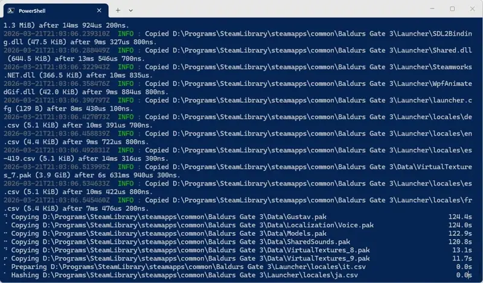

# memocp

> **Never organize the same file twice.** A blazing-fast, stateful copy CLI that remembers what you've copied.

`memocp` is a content-aware file copying tool built in Rust, designed for massive data curation pipelines. Instead of
relying on file names or modification dates, `memocp` uses cryptographic
hashes ([blake3](https://github.com/BLAKE3-team/BLAKE3)) to maintain a stateful database of every file it has
processed.

If it has seen a file's contents before - if it arrives under a different file name, or if you organized and
deleted the original months ago - `memocp` ignores it.

### Why does this exist?

`memocp` was built to handle massive, continuous data ingestion (20+ TiB scale).

Say you pull new "incoming" files from a variety of sources to a central repository for review, and you frequently
encounter duplicates. You might spend hours reviewing, organizing, or deleting 100's of gigabytes of files, only for
those exact same files to be re-downloaded in a new batch under different names, days or even years later.

By running `memocp` on incoming directories, you can ensure strictly out-of-band indexing (maybe a new sentence).
Once a file is copied, it is remembered in the database - a **memo**rized-**c**o**p**y.

### Features

* **Stateful:** Deduplicates source files by maintaining a database of previously copied files. If a file has been seen
  before, it is skipped.
* **Efficient:** Resumes from the last processed file by maintaining a persistent cache of source files and their
  hashes, so it doesn't need to rehash everything on every run.
* **Safe:** Designed to be crash-safe. Files are copied to a hidden temporary file and then atomically renamed to the
  final destination (an atomic operation),
  and all database operations are ACID (using [redb](https://github.com/cberner/redb)).
* **Fast:** Optimized for multithreaded network file systems but scales to local
  hardware limits. Uses multiple threads to perform IO operations concurrently to increase throughput on high-latency
  filesystems like CephFS. Easily hits 4+ GiB/s when hashing on a local NVMe drive (Windows 11, NTFS, NVMe).
* **Zero-Copy Reflinking:** Defaults to `reflink` mode (for CoW filesystems BTRFS, ZFS, XFS, APFS, ReFS), which enables
  shallow coping nearly instantly. Falls back to standard copy if needed.
* **Templated Destination:** Automatically copy source files into year/month/day folder hierarchies to avoid
  naming-conflicts (while maintaining the original file name and folder prefix).
* **Globbing:** Copy only files matching a glob pattern.

## Demo



## Installation

User x64 Linux and Windows binaries are available on
the [releases page](https://github.com/Silvenga/memocp/releases/latest) (request macOS or others).

```bash
curl -L https://github.com/Silvenga/memocp/releases/latest/download/memocp -o memocp
sudo install memocp /usr/local/bin/memocp
rm memocp
```

```pwsh
Invoke-WebRequest `
    -Uri https://github.com/Silvenga/memocp/releases/latest/download/memocp.exe `
    -UseBasicParsing `
    -OutFile memocp.exe
```

Linux container images are also available:

```bash
docker run -it --rm  ghcr.io/silvenga/memocp:latest --help
```

## Example

```bash
# Preload the database, marking each as seen.
memocp --load /path/to/destination

# Copy all files in /path/to/source to /path/to/destination
memocp /path/to/source /path/to/destination/{year_utc}/{month_utc}/{day_utc}
```

A file at `/path/to/source/holiday/photo.jpg`, last modified on December 25, 2023, would be copied to
`/path/to/destination/2023/12/25/holiday/photo.jpg`.

By default, the database will be stored in `./memocp.db`.

## Usage

```
Usage: memocp [OPTIONS] <SOURCE_PATH> [DESTINATION_PATH]

Arguments:
  <SOURCE_PATH>       The source directory to copy from
  [DESTINATION_PATH]  The destination directory to copy to. If the directory does not exist, it will be created

Options:
      --load
          Scan the source directory to populate the database of "seen" file hashes without copying files
      --no-cleanup
          Disable cleanup. This process prunes the cache for files that no longer exist
      --no-cache
          Disables reading or writing to the cache
      --glob <GLOB>
          The glob pattern to use for filtering files. Ignored if the source path is a file. Globs are matched case-insensitively
  -s, --state-file <STATE_FILE>
          The state file to use for memoization [default: ./memocp.db]
      --concurrency <CONCURRENCY>
          The maximum number of threads to use for hashing and copying. An additional thread will always be used for scanning. Defaults to `8` or the number of CPU cores, whichever is smaller [default: 8]
      --queue-depth <QUEUE_DEPTH>
          The maximum size of the discovery queue before the scanner will pause [default: 100000]
      --exclusive-lock
          Take an exclusive lock on files during hashing. You likely only want to use this under Windows, where file locking is more reliable
      --hashing-read-chunk-size <HASHING_READ_CHUNK_SIZE>
          The number of bytes to read at a time when hashing files, per thread. Supports units like "KiB", "MiB", "GiB", etc [default: "4 MiB"]
      --override
          Override existing files at the destination
      --mode <COPY_MODE>
          The copy mode to use [default: reflink] [possible values: hard-link, reflink, copy]
      --ignore-hidden
          Ignore hidden files
  -v, --verbose
          Enable verbose logging
  -h, --help
          Print help
  -V, --version
          Print version
```

## Template Syntax

The destination path can contain the following variables:

| Variable        | Description                                              |
|-----------------|----------------------------------------------------------|
| `{year_utc}`    | Year the file was last modified, in UTC.                 |
| `{month_utc}`   | Month the file was last modified, in UTC.                |
| `{day_utc}`     | Day the file was last modified, in UTC.                  |
| `{year_local}`  | Year the file was last modified, in the local timezone.  |
| `{month_local}` | Month the file was last modified, in the local timezone. |
| `{day_local}`   | Day the file was last modified, in the local timezone.   |

## Maybe Unexpected

- Directory symlinks are followed, file symlinks are not copied (the symlinked file is copied).
- Hidden files are considered by default.
- Actually tries to handle paths that have invalid UTF-8 characters. That was a pain to code.
- Source files are cached by (creation time, modified time, file size).
